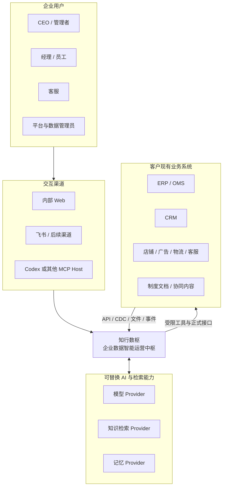
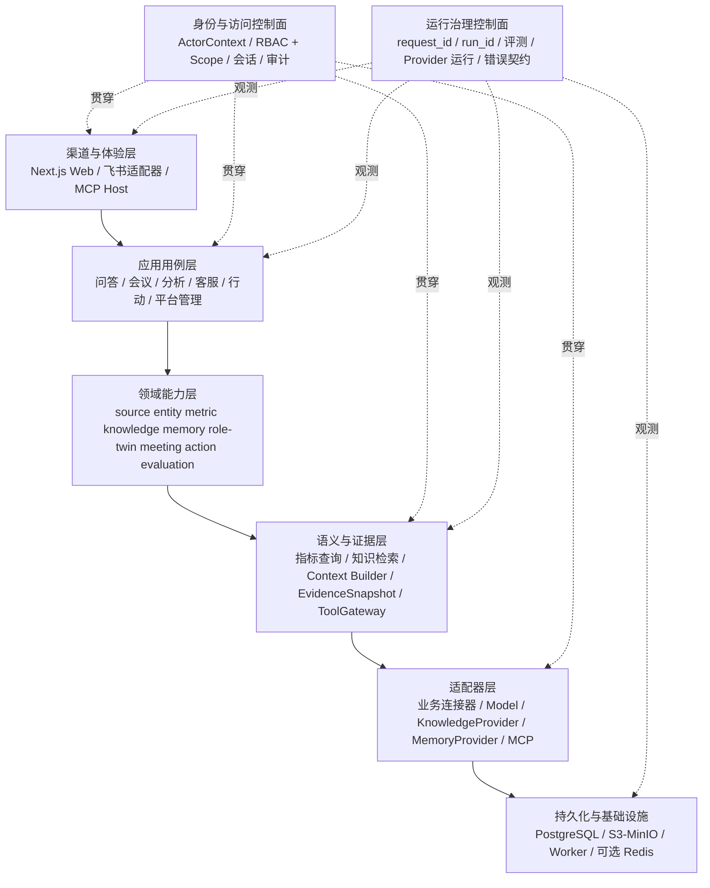
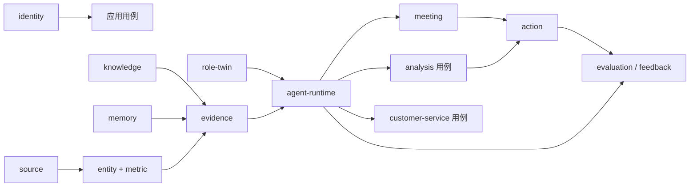
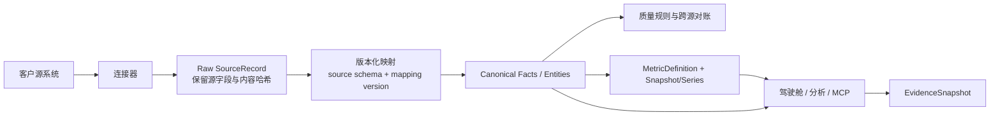
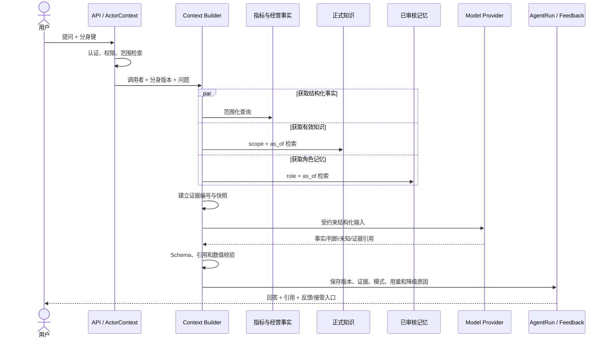
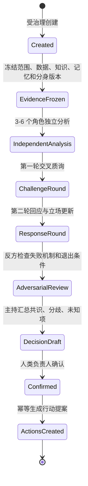
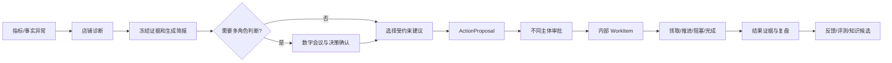
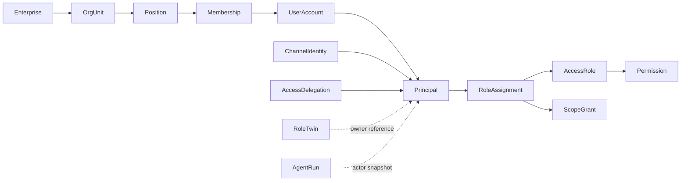
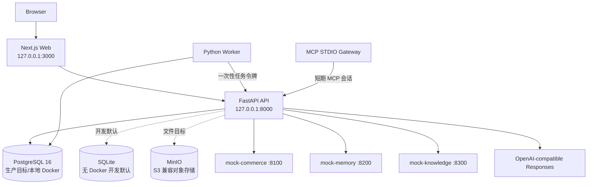
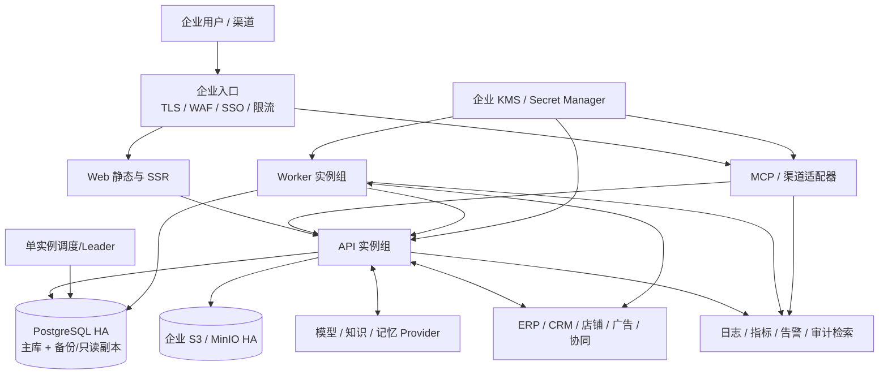

# 知行数枢完整产品架构

> 文档定位：产品、业务、应用、数据、AI、安全与部署架构总纲  
> 基线日期：2026-09-06  
> 适用范围：M0-M4 及客户私有化实施  
> 当前状态：代码基线分析稿，待产品负责人和技术负责人联合评审  
> 细化设计：本目录 `01`-`18` 号专题文档及 `adr/` 下的决策记录；当前状态和路线见 `docs/PROJECT-STATE-AND-ROADMAP.md`

## 1. 文档目的与结论

本文回答五个问题：知行数枢是什么产品，为什么采用当前架构，各模块如何协作，代码现在真实处于什么阶段，以及从本地纵向切片走向客户生产环境还需要补齐什么。

### 1.1 一句话定义

知行数枢是面向电商、零售和多系统运营企业的私有化数据智能运营中枢。它把分散的经营数据、正式制度、组织经验和业务工具组织成可追溯的企业事实与能力，再通过角色分身、数字会议、经营分析、运营工作和智能客服服务于不同岗位，并在人工授权和审批下逐步形成执行闭环。

它不是一个更大的聊天机器人，也不是替代 ERP、CRM 或客服系统的影子业务系统。它是现有业务系统之上的企业 `Data & Agent OS`：

```text
统一经营事实 + 版本化企业知识 + 受治理角色记忆
                         ↓
                可重放的证据上下文
                         ↓
        角色分身 / 数字会议 / 经营分析 / 客服
                         ↓
           人工确认 / 审批 / 内部工作 / 复盘
```

### 1.2 核心架构判断

1. **产品内核是可信事实与受控行动，不是模型。** 模型、知识检索产品和记忆供应商都可以替换；企业自己的事实、权限、版本、证据和行动台账不能交给供应商定义。
2. **逻辑上按领域完整分层，物理上暂时保持克制。** 当前团队和负载适合 Next.js Web、FastAPI 模块化单体、通用 Worker、PostgreSQL 和对象存储，不具备提前拆成大量微服务的收益证据。
3. **四类真值必须分离。** 经营事实、正式知识、角色记忆、运行与行动记录有不同的所有者、生命周期和冲突优先级，不能合并成“万能向量库”。
4. **证据快照是 AI 进入经营流程的关键边界。** 每次回答、分析和会议都应冻结实际使用的数据、制度、记忆和版本，使结论能够回放、审计和比较。
5. **权限是贯穿所有入口的控制面。** Web、渠道、API、Agent、MCP、Worker 和 Action 必须从可信 `ActorContext` 得到相同结果；RoleTwin 只能收窄能力，不能继承被模拟人员的权限。
6. **先建议、后审批、再执行。** 当前行动均限制为内部提案、审批和工作台账，`external_write=false` 是有意的产品安全边界，不是待隐藏的功能缺口。

### 1.3 当前代码基线概览

截至本基线，仓库已经形成可运行的本地纵向切片，而不是纯产品原型。详细当前状态和后续路线见 [`docs/PROJECT-STATE-AND-ROADMAP.md`](../PROJECT-STATE-AND-ROADMAP.md)：

| 维度 | 当前代码事实 | 架构含义 |
|---|---:|---|
| 数据库迁移 | 52 个 Alembic revision，最新为 `0052_meeting_runtime_run_history` | 多个领域纵向切片已经持久化 |
| ORM 模型 | 120+ 个 SQLAlchemy 模型 | 领域覆盖广，但物理模块边界需要继续收敛 |
| HTTP 接口 | 24 个路由模块 | Web 已有较完整的应用服务面 |
| Web 组件 | 38 个主要 `.tsx` 业务组件 | 主要产品空间已有真实页面或纵向切片 |
| MCP 工具 | 5 个受限 R0 只读工具 | AI 工具入口已建立统一会话、授权和审计 |
| 测试沙箱 | 电商、记忆、知识 3 类独立服务 | 可验证适配器契约，但不能等同生产集成 |
| 任务索引 | 110 项：10 done、14 review、13 in_progress、65 blocked、8 deferred | 计划状态与实现状态分离，详见项目现状总账 |

这些数字只描述代码覆盖面，不代表生产就绪度。当前最准确的阶段定义是：**M0 产品与平台骨架之上的多领域数据库纵向切片，正在向 M1 试点闭环和客户生产化收敛。**

## 2. 产品上下文

### 2.1 目标客户与边界

目标客户是已经同时使用 ERP/OMS、CRM、电商平台、广告、财务、物流、客服和企业协同工具，但数据口径、制度解释与经营动作仍依赖人工串联的企业。

| 客户问题 | 直接影响 | 产品回应 |
|---|---|---|
| 数据分散、源字段各异 | 报表冲突、取数慢、AI 无法稳定使用 | 连接器、原始区、规范事实、指标语义和血缘 |
| 制度持续变更 | 管理者重复解释，旧制度被继续引用 | 原件、不可变版本、生效区间、发布与退役 |
| 经验依赖个人 | 人员变化导致判断能力流失 | 岗位模板、个人记忆候选、审核和版本化分身 |
| 会议没有共同证据 | 观点无法对账，结论难复盘 | 冻结证据、多角色独立分析、质询与决策包 |
| AI 只生成文字 | 无法进入真实责任链 | 工具分级、行动提案、职责分离审批和工作台账 |
| 多渠道身份割裂 | 权限、回答版本和审计不一致 | 内部主体映射、统一 ActorContext 和渠道适配器 |

明确不承担的边界：

- 不复制现有 ERP、CRM、广告或客服系统的全部事务能力。
- 不让分析库成为业务写入入口。
- 不训练或承诺复制某个人的完整思维。
- 不让模型决定指标口径、权限、制度是否生效或外部动作是否获批。
- 不把测试沙箱数据量、模型演示或页面数量当成客户生产验收。

### 2.2 用户与责任视角

| 用户 | 默认工作视角 | 主要任务 | 明确限制 |
|---|---|---|---|
| CEO | 企业经营总览 | 看异常、追问原因、发起会议、确认决策 | 不能绕过职责分离审批自己的行动 |
| 部门经理 | 部门/门店工作台 | 诊断、审批、分配与复盘 | 不能读取企业全域或其他部门范围 |
| 员工 | 企业助手与我的工作 | 制度问答、岗位指导、领取工作、反馈 | 不能访问他人记忆、管理配置和越权数据 |
| 平台管理员 | 平台运行控制面 | 身份、数据源、工具、任务、Provider、审计 | 不天然拥有业务决策权和经营审批权 |
| 客服 | 客服辅助工作台 | 看订单与规则、生成草稿、转人工 | 高风险承诺和数据冲突禁止发送 |
| 数据/制度负责人 | 数据或知识治理页 | 映射、对账、发布、退役、冲突处理 | 不能通过治理角色自动获得业务执行权 |

### 2.3 产品价值循环


这个循环解释了为什么项目不能从“对话 UI”开始向外堆功能：如果没有 B 的真值治理、C 的证据冻结和 E 的责任边界，模型输出既不可复现，也无法安全进入经营流程。

## 3. 产品能力架构

### 3.1 能力地图

| 产品空间 | 核心能力 | 核心对象 | 当前成熟度 |
|---|---|---|---|
| 工作台与经营驾驶舱 | 角色首页、经营态势、异常和待办 | 指标摘要、运行事件、会议、行动 | 数据库驱动纵向切片 |
| 企业数据中心 | 来源、同步、规范事实、客户 360、实体、指标、质量 | SourceRecord、CommerceFact、CustomerProfile、MetricDefinition | 本地数据库纵向切片；真实连接器待实施 |
| 企业知识中心 | 导入、切片、制度版本、生效、引用、Provider 对照 | KnowledgeDocument、PolicyVersion、KnowledgeChunk | 生命周期已实现；对象存储和生产解析待补齐 |
| 角色分身中心 | 岗位模板、分身实例、记忆审核、配置版本、试跑 | RoleTemplate、RoleTwin、ApprovedMemory、AgentRun | 数据库纵向切片；正式渠道试点待完成 |
| 数字会议中心 | 受治理创建、独立分析、质询、反方审查、决策包 | Meeting、Claim、DeliberationTurn、DecisionPackage | 完整本地协议切片；生产模型预算与调度待强化 |
| 智能分析中心 | 问数、店铺诊断、简报、自动巡店 | EvidenceSnapshot、BusinessAnalysisRun、BusinessBrief | 人工与定时纵向切片；生产 SLO 待验证 |
| 行动与执行中心 | 提议、审批、工作领取、推进、结果台账 | ActionProposal、ApprovalEvent、WorkItem、WorkEvent | 内部闭环已实现；外部写入有意关闭 |
| 客服工作台 | 会话上下文、事实对账、回复草稿、门禁、接管 | Conversation、ReplyDraft、Handoff、ServiceEvent | 测试渠道纵向切片；真实渠道和生产发送未开放 |
| 平台管理 | 身份、组织岗位、访问角色、渠道绑定、任务、文件、审计 | Principal、AccessRole、ScopeGrant、BackgroundJob、Audit projection | 本地控制面纵向切片；SSO/HA/密钥系统待接入 |
| 反馈与评测 | 反馈工单、黄金集候选、批量回归、Provider 双跑 | EvaluationSuite、Run、Candidate、ProviderEvaluation | 运行器已实现；正式题量和客户基准待建立 |

成熟度术语统一如下：

- `prototype`：用于体验验收，状态或数据可能是 Fixture。
- `implemented-slice`：数据库、API、界面和测试已贯通，但只覆盖限定场景。
- `contract-sandbox`：通过模拟服务验证公共契约，不代表真实供应商已上线。
- `pilot-ready`：真实身份、真实数据、真实用户和评测门槛均满足后才可使用。
- `production-ready`：还需容量、可用性、安全、备份恢复和运维验收；当前不应对任何中心笼统使用这个标签。

### 3.2 产品空间与领域所有权不是一回事

一个页面经常组合多个领域。例如“店铺诊断”同时读取身份范围、指标、规范事实、证据快照和 AI 运行；它是应用用例，不拥有另一套指标或事实。产品导航用于用户完成工作，领域边界用于确定真值所有者。两者应通过稳定读模型组合，不能按页面复制数据模型。

## 4. 架构原则与原因

| 原则 | 采用原因 | 放弃的捷径 | 代价 |
|---|---|---|---|
| 企业事实优先 | 经营结论必须可对账 | 让模型根据 Prompt 自由计算或补值 | 需要指标目录、映射和质量治理 |
| 逻辑完整、物理克制 | 保留演进边界，控制首期运维成本 | 首期微服务或一个无边界的大 Agent 服务 | 单体内部仍需严格模块纪律 |
| 自有契约优先 | 可替换供应商并保护企业语义 | 直接暴露 WeKnora、Mem0、Codex 等内部对象 | 需要适配器和契约测试 |
| 真值分离 | 各类资产的生命周期和可信度不同 | 万能向量库或一张上下文表 | 跨域组合必须经过证据服务 |
| 不可变版本与追加事件 | 历史结论可以复现 | 覆盖“当前值”后丢失历史 | 存储和查询模型更复杂 |
| 证据先于判断 | AI 输出可核查、可降级 | 只保存最终回答 | 每次运行需要冻结和引用校验 |
| 默认拒绝与权限交集 | 防止分身、渠道和工具提权 | 仅靠菜单隐藏或角色名称判断 | 授权检查贯穿所有入口 |
| 先建议后执行 | 逐步建立业务信任 | 早期直接写 ERP/店铺/客户渠道 | 自动化收益释放更慢但风险可控 |
| 纵向切片交付 | 每阶段能证明客户价值 | 长期建设底座或只做静态页面 | 同一单体中会暂时存在成熟度不均 |
| 以触发条件演进 | 基于真实瓶颈选择基础设施 | 为未来规模提前上湖仓、Kafka、Temporal | 需要持续记录容量和 SLO |

## 5. 系统上下文



信任边界有三条：

1. 外部渠道身份和请求不能直接成为内部主体，必须经过认证或显式 `ChannelIdentity` 映射。
2. 外部系统字段不能进入上层业务和 AI 契约，必须经过连接器、原始保留和版本化映射。
3. 模型和第三方 Provider 只能消费授权后的最小上下文，不能成为企业真值或权限决策者。

## 6. 逻辑分层架构



依赖方向必须从入口指向应用用例，再指向领域契约和适配器。Web 不访问数据库，MCP 不保存业务规则，Provider 不反向定义领域对象，跨领域写入不通过直接联表完成。

## 7. 领域架构

### 7.1 限界上下文

| 领域 | 独占职责 | 对外提供 | 不允许拥有 |
|---|---|---|---|
| `identity` | 企业、主体、用户、组织、岗位、任职、访问角色、范围、渠道映射 | ActorContext、授权结果、身份投影 | RoleTwin 内容、业务事实 |
| `source` | 来源注册、连接器、批次、游标和错误 | ConnectorBatch、SyncRun | 指标口径和上层分析 |
| `entity` | 稳定业务实体和外部 ID 映射 | 规范实体引用 | 人员组织真值、源私有字段 |
| `metric` | 规范经营事实、指标定义、序列和质量 | MetricQuery、CommerceFactQuery | 自由文本知识 |
| `knowledge` | 原件、解析、版本、生效、发布、检索 | 带版本与定位的知识证据 | 个人偏好和经营事实 |
| `memory` | 聊天导入、候选、审核、激活、退役、检索 | 已审核记忆引用 | 当前制度和经营事实真值 |
| `role-twin` | 岗位模板、个人实例、能力边界、配置版本 | 已发布分身版本 | AccessRole 和供应商内部 ID |
| `evidence` | 跨真值引用、快照、证据编号和可回放信息 | EvidenceSnapshot | 业务判断和源数据所有权 |
| `agent-runtime` | AgentRun、上下文编排、模型与工具调用记录 | 结构化运行结果 | 企业事实和审批真值 |
| `meeting` | 议题、观点、质询、风险审查、决策包 | 已确认决策 | 指标定义和行动审批 |
| `action` | 提案、职责分离审批、执行登记、工作状态机 | 受治理行动和工作项 | 任意外部直写后门 |
| `channel` | 签名校验、消息规范和渠道展示 | 内部身份声明和标准消息 | 持久身份映射和问答逻辑 |
| `evaluation` | 反馈、黄金集候选、回归和供应商对照 | 质量结论和基线比较 | 在线业务真值 |
| `operations` | 运行配置、任务、通知、文件、成本和可观测投影 | 运维控制面 | 授权决策和领域规则 |

### 7.2 关键依赖



`analysis` 和 `customer-service` 是组合型应用能力，不应再建立一套指标、客户交易或知识真值。当前代码通过服务层组合这些能力，后续物理拆分时仍应保持这一所有权规则。

## 8. 数据与真值架构

### 8.1 四类业务资产与一个控制面

| 类型 | 典型内容 | 权威来源 | 主要存储 | 允许进入 AI 的方式 |
|---|---|---|---|---|
| 经营事实 | 订单、退款、库存、广告、客户触点、指标 | 业务系统经版本化映射后的规范事实 | PostgreSQL 首期事实表；规模化后可拆分析存储 | Metric/Fact 查询后写入 EvidenceSnapshot |
| 正式知识 | 制度、SOP、KPI、FAQ、正式结论 | 已发布且在时点有效的知识版本 | 元数据和切片在 PostgreSQL，原件目标为 S3 | KnowledgeProvider 返回稳定 chunk 引用 |
| 角色记忆 | 偏好、案例、表达习惯、反例 | 审核并激活的 ApprovedMemory | PostgreSQL 真值，Provider 仅保存评测/检索副本 | Context Builder 按角色和时点选择 |
| 运行与行动 | AgentRun、会议、提案、审批、工作和反馈 | 平台追加式运行和领域事件 | PostgreSQL | 只用于上下文、复盘和评测，不反向覆盖前三类真值 |
| 身份控制面 | 主体、组织岗位、权限、范围、会话、委托 | identity 领域 | PostgreSQL | 只决定可读取什么和可执行什么，不作为回答内容真值 |

### 8.2 事实优先级

```text
当前生效制度
  > 已确认经营事实与指标定义
  > 已审核 FAQ 和正式决策案例
  > 已审核长期记忆
  > 未审核历史聊天
  > 模型一般知识
```

这个优先级解决的是冲突，不是简单排序召回分数。检索命中低优先级内容时，系统应返回更高优先级事实并说明冲突；不能通过提高向量相似度让旧聊天覆盖当前制度。

### 8.3 经营数据链路



关键规则：

- 连接器必须返回稳定 `ConnectorBatch`，上层不得读取供应商字段。
- 每条规范事实保留 `enterprise_id`、来源、源 Schema、映射版本和同步批次。
- 只有连接器明确声明成功取得的 `authoritative_fact_types` 才允许清理同源缺失旧事实；部分失败不能被当成业务删除。
- ERP/OMS 是订单、订单行、退款和库存金额的交易真值；CRM 负责客户主档与行为触点，不得覆盖交易金额。
- `DataScopeMapping` 把平台的企业/门店范围键映射到客户源业务键，页面、AI 和 MCP 共用同一解析器。
- 指标必须先登记名称、公式、维度、粒度、负责人、版本和生效区间，才能进入结构化问答。

### 8.4 版本、时点与血缘

所有影响结论的对象使用不可变版本或追加式事件：制度、指标、分身配置、Prompt/行为规则、记忆、工具定义、评测集、简报、行动状态和授权决策。所谓“当前版本”只是指针，不覆盖历史。

每次运行至少固定：

```text
enterprise_id
actor / on_behalf_of / policy_version
business scope + business timezone
source sync run + mapping version + as_of
knowledge version + effective interval + chunk locator
approved memory version
role twin version + model/provider
request_id + run_id + idempotency key
```

这组信息是数字会议复盘、客服争议处理、模型回归和授权审计的共同基础。

## 9. AI、角色分身与证据架构

### 9.1 运行时上下文公式

一次分身或智能体运行的有效上下文不是“把能搜到的内容全部塞给模型”，而是：

```text
有效上下文
= 调用者授权范围内的经营事实
+ 当前时点有效的正式知识
+ 当前分身已审核且适用的角色记忆
+ 当前会话/议题上下文
+ 分身版本与能力约束
+ 渠道和工具风险约束
```

一次运行的有效能力为：

```text
调用者权限
∩ RoleTwin 能力白名单
∩ 渠道允许能力
∩ MCP 会话工具/范围上限
∩ Action 风险和审批规则
```

两个公式分别回答“模型能看到什么”和“模型能做什么”。两者都由服务端计算，不能由 Prompt 或客户端参数声明。

### 9.2 带证据的分身问答



模型超时、结构不合法、引用越界或数字无法在证据中找到时，系统应只降级本阶段，并把 `fallback_reason` 写入运行记录。降级结果也必须引用证据，不能伪装成模型成功。

### 9.3 当前 Provider 边界

| 能力 | 当前实现 | 平台真值 | 目标方向 |
|---|---|---|---|
| 模型 | `ResponsesAIProvider` 业务路径；分身问答使用 `AgentRuntime` 与 Codex `app-server` | AgentRun、EvidenceSnapshot、Runtime Session/Turn/Event、结构化结果 | 迁移其他 AI 业务并补齐审批恢复与预算控制 |
| 知识检索 | WeKnora、RAGFlow、OpenViking 三路适配和 `mock-knowledge` | KnowledgeDocument/Version/Chunk | 用客户文档基准选型，可单路或组合部署 |
| 长期记忆 | TencentDB-Agent-Memory、Mem0 双跑和 `mock-memory` | MemoryCandidate/ApprovedMemory | 按召回、延迟、隔离和运维成本选型 |
| 工具协议 | 官方 MCP Python SDK 的独立 STDIO 网关 | API 工具注册、授权和调用台账 | 扩展 R1/R2；R3 仍必须进入 Action |
| 编排 | 应用服务和显式数据库状态机 | 会议、分析、行动领域表 | 只有跨天恢复/补偿成为瓶颈后再评估 Temporal/LangGraph |

当前代码中数字会议独立分析、两轮质询、反方审查和主持汇总均已由独立 `CodexRuntimeAdapter` 承接，并持久化平台自有的 Runtime Session、Thread、Turn 与脱敏 Event；经营分析、客服和评测仍主要由各应用服务通过统一 Provider 完成。分身多轮追问复用同一 Thread，会议每个阶段运行单独创建 AgentRun、证据快照映射和当前真实主体的短期 MCP 会话。MCP 网关保持独立，只负责协议发布，不是 Agent Runtime，也不拥有业务数据。

### 9.4 MCP 工具与风险分级

当前网关发布五个 R0 只读工具：

| 工具 | 作用 | 权限与范围 |
|---|---|---|
| `read_policy` | 读取当前制度版本与原文定位 | 知识读取 + 知识空间/企业范围 |
| `search_knowledge` | 检索企业知识切片 | 知识读取 + 文档范围 |
| `get_metric` | 读取指标口径与时间序列 | 指标查询 + 企业/门店范围 |
| `query_commerce_facts` | 查询规范经营事实 | 指标查询 + 平台范围映射 |
| `query_customer_360` | 查询客户汇总或单客详情 | 客户读取 + 平台范围映射 |

工具风险等级：

- `R0 查询`：只读制度、指标、实体和证据。
- `R1 分析`：生成诊断、报表或建议，不产生外部状态变化。
- `R2 草拟`：创建回复、任务或操作计划草稿。
- `R3 执行`：改变外部系统状态，必须由 Action 服务审批、幂等执行并记录补偿语义。

MCP 会话固定客户端、工具白名单、可选范围和有效期；令牌只返回一次，数据库只保存哈希。每次调用都按当前数据库权限重新授权，因此签发后撤权会在下一次调用生效。

### 9.5 数字会议协议

数字会议不是多个分身答案的拼接，而是对同一证据快照执行结构化审议：



当前单次三角色运行保存 11 个可审计 AgentRun：3 次独立分析、6 次质询/回应、1 次风险审查和 1 次主持汇总。确认后的决策包被锁定；需要重新研判时创建新议题，不能覆盖历史结论。

### 9.6 反馈、人工接管和评测

反馈不能直接修改制度、记忆、Prompt 或外部系统。正确闭环是：

```text
回答反馈
  -> 人工接管工单
  -> 负责人认领和解决
  -> 纠错候选
  -> 治理人员接纳/拒绝
  -> 不可变评测案例新版本
  -> 批量回归
```

评测至少分为四层：

1. 契约和组件测试：连接器、解析、映射、状态机、工具 Schema。
2. 确定性场景检查：证据数量、必需引用、禁止表述、权限拒绝、幂等。
3. 人工质量审核：事实正确、思路相似、表达合适、边界清楚。
4. 业务试点指标：重复问询、管理者耗时、转人工率、纠错成本和采纳率。

首批 6-7 题 smoke 套件只证明运行器可用，不替代规划中的 100 题制度集、30 题指标集和 30 题角色集。

## 10. 核心业务链路

### 10.1 经营异常到内部工作闭环



所有箭头都携带稳定业务键、范围、证据或追加式事件。分析建议不能直接创建外部动作；审批通过也只创建当前 `external_write=false` 的内部工作凭证。

### 10.2 客服辅助链路

客服链路把渠道履约上下文和规范交易事实分层处理：

1. 渠道会话提供消息、物流和售后上下文。
2. 稳定订单键和门店范围映射查询 ERP/OMS 规范订单、退款和金额。
3. 对账器区分已关联、售前无需关联、等待同步、范围不符，以及一致、冲突、未对账。
4. 当前有效客服制度提供补偿、物流、退款、支付发票、商品活动和高风险条款。
5. 模型只能基于本次 `D*` 数据和 `K*` 制度证据生成草稿。
6. 服务端确定性门禁在“生成”和“发送”两个时点重查重大差异与风险。
7. 中高风险、范围问题、数据冲突或客户要求人工时进入接管，不允许模型覆盖门禁。

当前“发送”只写本地 `commerce-sandbox` 台账，不代表真实对客发送已经开放。

### 10.3 自动巡店链路

```text
StoreReviewPlan
  -> API 调度器按业务时区识别到期计划并幂等入队
  -> BackgroundJob(analysis.daily-store-review)
  -> Worker 领取并获得一次性执行令牌
  -> API 按计划创建人的当前账号、权限和范围重新授权
  -> 复用人工诊断、证据和简报服务
  -> 可选创建 pending_approval 提案
```

计划中的 Actor 快照只用于解释“为什么当时允许入队”，不能让已经撤权的主体继续执行。

## 11. 应用与代码架构

### 11.1 Monorepo 结构

| 路径 | 当前责任 | 架构约束 |
|---|---|---|
| `apps/web` | Next.js 16、React 19 管理台和三维经营空间 | 只调用企业 API；菜单是权限投影 |
| `services/api` | FastAPI 模块化单体、领域应用服务、迁移和种子 | 业务真值、授权和用例边界；不得让路由承载核心规则 |
| `services/worker` | 后台任务轮询和处理器注册 | 不复制领域查询、Prompt 或授权逻辑 |
| `packages/jobs` | 通用任务状态机、租约、重试和幂等 | 与业务 job_type 解耦 |
| `packages/observability` | request_id、run_id 和结构化日志上下文 | 不依赖 Web 框架和数据库 |
| `packages/contracts`、`contracts` | 跨进程 JSON Schema 和稳定协议 | 不从 ORM 或供应商对象自动泄漏 |
| `mcp/enterprise-gateway` | 官方 MCP SDK STDIO 网关 | 只调用 API，不连接业务数据库 |
| `services/mock-*` | 电商、记忆和知识公共契约沙箱 | 只用于回归和开发，不能进入生产拓扑 |
| `evals` | 评测案例和运行契约 | 评测版本与业务真值分离 |
| `deploy`、`tools`、`scripts` | 本地编排、验证和统一命令 | 部署变更必须可重复、不可泄密 |

### 11.2 Web 应用

Web 使用一个 `/console/[[...path]]` 入口和稳定导航注册表，将服务器返回的权限投影为工作台、驾驶舱、数据、知识、分身、会议、分析、行动、客服和平台管理空间。浏览器统一 API Client 传播 `X-Request-ID`、`X-Run-ID` 和 HttpOnly 会话。

应用壳只负责体验层能力：导航、筛选、加载、错误、无权限、详情工作区和响应式布局。后端继续对直接 URL 和 API 调用做权限与数据范围检查。

三维数字孪生是数据库中企业节点、空间、路线、会议和事件的运行投影，用于空间感知和场景导航；二维驾驶舱与工作台仍是高密度经营操作主界面。三维场景不能成为指标、会议或动作真值。

### 11.3 API 模块化单体

FastAPI 当前注册身份、审计、平台、数据、知识、记忆、分身、会议、行动、分析、客服、工具和评测等路由。典型用例遵循：

```text
Router / Schema
  -> ActorContext 与用例级授权
  -> Application Service
  -> SQLAlchemy Repository/Query + Provider Adapter
  -> Pydantic Read Model
```

当前 `services/api/src/zhixing_api/data_models.py` 集中了 116 个模型，多项应用服务文件已达到数万行。逻辑领域边界清楚，但物理代码边界正在接近维护拐点。下一阶段应在不拆部署单元的前提下，按限界上下文拆包、定义公开服务接口和模块测试，避免模块化单体退化成共享模型单体。

### 11.4 后台任务

PostgreSQL 任务表提供 `queued -> running -> succeeded/retry_wait/failed` 状态机、Attempt 记录、指数退避、租约恢复、`FOR UPDATE SKIP LOCKED` 并发领取和幂等入队。

任务 v2 固定发起主体快照、排队时权限版本、声明权限、目标范围、`request_id` 和 `run_id`。Worker 领取时得到一次性令牌，数据库只保存哈希，终态或租约过期后失效。涉及业务真值的处理仍回到 API 用当前权限执行。

## 12. 集成架构

### 12.1 接入方式选择

| 数据/动作类型 | 推荐方式 | 原因 |
|---|---|---|
| 订单、广告、库存等分析事实 | API/CDC/文件批量复制到分析事实层 | 支持历史、对账、回放和跨源分析 |
| 少量强实时状态 | 查询时调用源系统 API | 避免复制后产生不可接受的时延 |
| 制度与附件 | 原件进入对象存储，元数据/切片进入知识层 | 保留原件、哈希、版本和引用定位 |
| 渠道消息 | 签名校验后的 Webhook/事件适配器 | 外部身份必须映射到内部主体 |
| AI 工具 | MCP 或内部应用 API | 统一 Schema、权限、风险和审计 |
| 外部写入 | 源系统正式 API，经 Action 审批和幂等执行 | 不直接写分析库，不靠模型自由调用 |

### 12.2 连接器契约

每个客户系统实现独立连接器并返回平台自有 `ConnectorBatch`。连接器负责：

- 源认证和分页/游标；
- 原始响应和内容哈希；
- `source_schema_version` 与 `mapping_version`；
- 外部 ID 到稳定企业 ID 的映射；
- 规范事实族和权威完整性声明；
- 可重试、部分失败和永久失败语义；
- 数据时间、同步时间和来源血缘。

接入一个新客户时，优先替换连接器、映射和范围配置，不修改页面、Prompt、MCP 工具或分析用例。只有跨客户稳定且需要约束的概念，才升级为新的规范事实或数据库迁移。

### 12.3 渠道适配

真实飞书/企业微信接入的正确链路是：

```text
签名和租户校验
  -> 提取外部身份
  -> ChannelIdentity 哈希映射
  -> 当前内部账号、任职、访问角色和范围
  -> 标准应用用例
  -> 渠道格式化响应
```

未知身份进入绑定或人工处理，不按姓名自动匹配。群聊中的权限仍来自实际提问人，而不是群主、机器人或 RoleTwin。

## 13. 身份、安全与治理架构

### 13.1 身份模型



`Position` 表示组织职责，`AccessRole` 表示访问能力，`RoleTwin` 表示知识、记忆和表达边界；三个概念必须保持分离。

### 13.2 授权链

1. 认证边界建立内部会话或受信服务身份。
2. 服务端从数据库解析 `ActorContext`，客户端不能提交权限列表或企业覆盖值。
3. 路由检查功能权限，领域查询检查资源与数据范围。
4. 分身、MCP 会话和渠道能力与调用者权限取交集。
5. 后台任务入队保存快照，执行前重新加载当前账号和权限。
6. 行动审批检查职责分离、对象范围、幂等键和乐观版本。
7. 允许和拒绝都记录 `AuthorizationDecision`、策略版本和追踪 ID。

### 13.3 当前认证与目标认证

| 范围 | 当前状态 | 生产目标 |
|---|---|---|
| Web 登录 | 本地密码 + 服务端 HttpOnly 会话；开发身份兼容仅限非生产 | 企业 OIDC/飞书/反向代理认证适配，MFA 由企业 IAM 承担 |
| MCP | 短期受限会话、客户端绑定、工具白名单、令牌哈希 | 服务身份、密钥轮换、网络隔离和细粒度撤销 |
| Worker | 任务一次性执行令牌 + 当前权限重查 | 独立服务身份、mTLS/内部网关、最小网络权限 |
| 渠道 | 数据库绑定生命周期已实现 | 真实签名校验、租户隔离、消息去重和限流 |
| 文件 | 本地文件资产和权限下载 | S3 对象存储、服务端加密、病毒扫描和保留策略 |

### 13.4 审计与敏感信息边界

运行日志、授权审计和领域事件保持各自真值。统一审计中心只在读取时投影身份变更、授权决策、MCP 会话、工具调用、后台任务、AgentRun 和行动工作等来源，不复制第二套日志真值。

日志和审计响应禁止包含：密码、API Key、Cookie、Bearer Token、外部身份原文、Prompt 全文、制度全文、工具完整输入输出、后台任务载荷、模型回答全文或客户原始记录。外部身份、会话令牌和 Worker 执行令牌只保存哈希或短提示。

生产环境还需要补齐字段级敏感数据分类、脱敏策略、数据保留/删除、备份访问审计、密钥管理系统和客户安全基线评审。

## 14. 物理部署与演进

### 14.1 当前本地拓扑



本地 `compose.yaml` 默认只提供 PostgreSQL 和 MinIO，Redis 是可选 profile。三个 mock 服务属于开发工作区进程，不应随产品进入客户生产环境。SQLite 只适合单进程开发和测试；并发任务领取依赖 PostgreSQL 的 `FOR UPDATE SKIP LOCKED`。

### 14.2 建议的客户生产拓扑



生产部署前必须先处理两个多实例问题：

1. 当前 API 启动时自动执行迁移和播种，应改为独立、显式、可审计的部署 Job；应用实例只做 revision 兼容检查。
2. 当前会议和巡店调度器在 API lifespan 中启动。API 多副本前必须迁到独立 Scheduler/Worker，或增加数据库 Leader Lease；不能依赖幂等键掩盖每个副本都在轮询的资源浪费和竞态。

另外，当前文件资产服务默认落本地路径，虽然本地编排已提供 MinIO。客户生产前应完成 S3 适配、内容完整性、病毒扫描、加密、生命周期和备份恢复验证。

### 14.3 网络与信任区域

建议至少划分：

- **入口区**：反向代理、SSO 回调、渠道 Webhook、限流和签名校验。
- **应用区**：Web、API、MCP/渠道适配器，不接受公网直连数据库。
- **任务区**：Worker 和 Scheduler，只使用独立服务身份访问内部 API、数据库和允许的外部源。
- **数据区**：PostgreSQL、对象存储、备份和可选分析存储。
- **Provider 区**：模型、知识和记忆端点，通过允许清单、超时和最小上下文访问。
- **运维区**：日志、指标、告警、堡垒机和密钥管理。

### 14.4 何时才拆基础设施

| 候选演进 | 触发条件 | 当前结论 |
|---|---|---|
| 拆分微服务 | 独立扩容、发布、故障隔离或团队所有权有可测需求 | 继续模块化单体，先拆代码包 |
| ClickHouse/专用仓库 | 经营事实影响事务库，优化后聚合仍不达 SLO，或需独立保留/扩缩容 | 先在 PostgreSQL 建立容量基线 |
| Temporal | 跨小时/跨天、人工暂停、多步补偿和可靠恢复无法由任务表清楚表达 | 当前 PostgreSQL Worker 足够 |
| Redis/RabbitMQ | 大量短任务吞吐成为瓶颈，或需要实时进度广播 | Redis 保持可选 |
| 外部策略引擎 | 条件策略和关系授权显著增加，跨服务共享授权成为瓶颈 | 继续确定性 RBAC + Scope |
| OpenMetadata/MetricFlow | 资产、口径和维度组合达到人工维护瓶颈 | 继续最小自有目录和指标契约 |
| 专用向量服务 | 客户知识量、权限过滤和延迟基准证明 PostgreSQL/Provider 内置能力不足 | 先通过 Provider 对照评测选择 |

## 15. 非功能架构与验收目标

以下是进入试点和生产评审前应共同确认的质量框架。已有明确门槛沿用项目基线；未定数字标记为“客户定标”，不能在实施时省略。

| 质量属性 | 现有设计保障 | 试点/生产验收要求 |
|---|---|---|
| 授权安全 | 默认拒绝、RBAC + Scope、全入口 ActorContext | 越权读取和未授权执行 0 例；撤权在下一次调用/执行生效 |
| 证据完整性 | EvidenceSnapshot、不可变版本、引用编号 | 制度结论引用覆盖率 100%；无依据确定性结论低于 2% |
| 指标准确性 | MetricDefinition、映射版本、对账样例 | 指标对账准确率不低于 99%，舍入规则显式 |
| AI 质量 | 结构化输出、引用/数字校验、回退、评测集 | 已知问题事实正确率不低于 95%；废止制度误用 0 例 |
| 幂等与一致性 | 请求键、内容哈希、乐观版本、追加事件 | 网络重试不重复创建会议、提案、工作、同步或发送事件 |
| 可观测性 | request_id、run_id、AgentRun、Attempt、统一错误 Envelope | 关键链路可从入口追踪到任务、模型、工具和行动；告警阈值客户定标 |
| 数据新鲜度 | source time、sync time、as_of、延迟状态 | 按数据源定义 SLA；页面和回答必须展示截至时间与延迟 |
| 性能 | 分页、90 天序列、PostgreSQL 索引、后台任务 | 核心读接口、批量同步、AI 运行分别建立 p50/p95/p99 基准 |
| 可用性 | 独立 Worker、租约恢复、Provider 降级 | API/任务/Provider 分开定义 SLO；生产拓扑需消除单点 |
| 恢复能力 | Alembic、幂等种子、追加历史 | PostgreSQL 与对象存储联合备份；RPO/RTO、恢复演练客户定标 |
| 隐私合规 | 最小上下文、哈希令牌、审计允许清单 | 数据分类、保留删除、跨境/出域、模型数据使用政策完成评审 |
| 可维护性 | Monorepo、统一命令、严格类型和测试 | 领域包依赖检查、契约兼容测试、ADR 与迁移门禁纳入 CI |
| 可访问与响应式 | 桌面/超宽/移动布局基线 | 核心查看、问答和审批在目标视口无溢出；复杂配置可限定桌面 |

生产容量不能由当前 large 沙箱推导。当前 50,131 条原始记录、18,761 条规范事实、600 个客户主档、3,600 条触点、5,424 个实体和 21 个指标只证明了映射、持久化、分页、对账和 90 天趋势链路。客户实施必须重新盘点峰值、历史保留期、增量频率、查询并发和模型预算。

## 16. 当前成熟度与目标态差距

### 16.1 三个状态维度必须分开

项目目前同时存在三套容易混淆的状态：

1. **代码存在性**：迁移、API、页面和测试是否已经贯通。
2. **产品验收状态**：任务是否经过产品负责人或领域负责人确认。
3. **生产就绪度**：真实身份、真实数据、容量、安全、HA 和运维是否通过。

`implemented-slice` 只能回答第 1 项。任务索引中的 `review/blocked` 主要回答第 2 项依赖；二者都不能自动推出第 3 项。

### 16.2 能力差距矩阵

| 能力 | 当前已证明 | 进入试点/生产仍需完成 |
|---|---|---|
| 身份与权限 | 本地密码、服务端会话、数据库 RBAC/Scope、渠道绑定、MCP/Worker 重授权 | SSO/MFA 集成、真实渠道签名、服务身份、权限全链路覆盖审计 |
| 数据接入 | 四源确定性沙箱、规范电商事实、客户 360、范围映射、质量对账 | 客户真实连接器、后台分页/回填、Schema 漂移、容量与保留期 |
| 知识 | 文本导入、哈希、切片、发布/退役、时点读取、三 Provider 评测 | 对象存储原件、后台大文件解析、OCR/表格、权限过滤与客户基准 |
| 记忆 | 聊天导入、候选、审核、激活/退役、双 Provider 评测 | 隐私/保留、客户数据导入、真实 Provider 选型和大规模召回基准 |
| 分身问答 | 发布版本、证据化回答、反馈接管、试跑、批量评测、Runtime 多轮/取消/详情 | 审批恢复、渠道试点、预算/限流、正式黄金集和业务指标 |
| 数字会议 | 范围化创建、11 阶段运行、质询、确认和行动来源 | 异步长运行、并发/成本预算、通知、复盘回写和生产故障恢复 |
| 经营分析 | 指标+事实证据、模型/降级、简报、定时巡店 | 真实阈值治理、跨店归因、数据 SLA、后台规模和通知分发 |
| 行动工作 | 多来源提案、职责分离审批、内部工作状态机 | R3 工具目录、源系统写接口、审批策略、补偿、回滚和紧急停机 |
| 智能客服 | 数据对账、证据草稿、确定性门禁、接管、沙箱发送 | 正式渠道、限流、撤回/失败恢复、灰度、投诉监控和紧急停机 |
| 平台运维 | 任务、参数、字典、通知、文件、批量交换、统一审计、AI 控制台 | 集中指标/日志、告警、KMS、S3、备份恢复、HA、升级与回滚手册 |

### 16.3 任务索引与代码基线漂移

`tasks/task-index.yaml` 仍将 65/110 项标为 blocked，但代码已通过 `0014`-`0049` 等迁移实现了身份、工具、知识、记忆、分身、会议、分析、客服、行动、平台管理、集团范围和 Skill 的多项纵向切片。这个差异会造成三类风险；当前对账规则和路线以 [`docs/PROJECT-STATE-AND-ROADMAP.md`](../PROJECT-STATE-AND-ROADMAP.md) 为准：

- 新成员无法判断真实完成范围，可能重复实现或错误依赖旧任务状态。
- 产品负责人可能把“有代码”误认为已验收，或把“blocked”误认为完全没有实现。
- 发布、测试和文档无法从统一基线生成。

建议立即进行一次“任务-迁移-API-页面-测试”对账：不为了追赶代码而直接把正式任务标为 done，而是为每项记录 `implementation_status`、`product_acceptance` 和 `production_readiness` 三个字段，必要时将提前完成的代码归入显式 `implemented-slice` 验收项。

### 16.4 建议演进门

| 阶段 | 重点 | 退出条件 |
|---|---|---|
| G0 基线收敛 | 产品全景验收、任务索引对账、领域包拆分计划 | UIA-006 有明确结论；架构、代码和任务状态一致 |
| G1 管理者分身试点 | 真实制度、真实员工、正式身份、黄金集 | 引用/正确率/越权/转人工门槛通过，管理者确认角色边界 |
| G2 数据与会议试点 | 一个真实经营源、指标对账、三角色会议 | 数据 SLA 和 99% 对账通过，决策包可复盘，模型预算可控 |
| G3 受控运营 | 自动巡店、内部工作、真实通知、有限 R2 | 任务恢复、审批职责分离、告警和人工停机通过 |
| G4 客服与 R3 灰度 | 真实渠道、低风险自动化、外部工具 | 灰度、回滚、补偿、投诉监控和安全评审全部通过 |
| G5 生产规模化 | HA、备份、容量、升级、合规 | 压测、恢复演练、SLO 和运维交接通过 |

## 17. 关键决策：为什么这样架构

### 17.1 为什么是模块化单体，而不是微服务

当前领域很多，但团队、负载和发布边界尚未形成对应的独立需求。微服务会立即引入分布式事务、服务认证、部署编排、网络故障和跨服务调试成本，却不能提高首期客户价值。模块化单体允许在一个事务中完成证据、运行和审计记录，同时通过限界上下文和自有契约为未来拆分保留边界。

正确的下一步不是拆进程，而是先把 `data_models.py` 和超大 service 文件按领域拆包，建立公开接口和禁止跨域私有查询的测试。只有独立扩容、发布、故障隔离或团队所有权出现后再拆服务。

### 17.2 为什么先用 PostgreSQL，而不是完整湖仓

首期数据量和查询模式可以由 PostgreSQL 支撑，同时身份、知识元数据、任务、运行和行动需要强事务与一致审计。使用同一数据库降低了纵向切片复杂度。经营事实仍在逻辑上分 Raw/Mapping/Core/Semantic，未来可以把物理事实存储迁到 ClickHouse 或仓库，而不改变上层 Metric/Fact 契约。

### 17.3 为什么任务队列先放 PostgreSQL

当前任务量有限，任务表可以与发起主体、幂等键、领域结果和审计共享事务边界，并避免 Redis 立即成为关键依赖。`SKIP LOCKED`、租约和 Attempt 已覆盖短中期后台任务。跨天计时、多步骤补偿和人工中断恢复出现后，Temporal 才能提供明确收益。

### 17.4 为什么保留企业自有契约

WeKnora、RAGFlow、OpenViking、Mem0、TencentDB Agent Memory、Codex 和模型 Provider 的内部模型都可能变化。若上层保存其 ID、表结构或私有 API，客户数据和业务流程会被供应商锁定。自有契约把供应商能力限制在适配器层，使替换只影响索引、检索或运行实现，不改角色、会议、证据和行动领域。

### 17.5 为什么需要 EvidenceSnapshot

直接在每次查看时重新查询“最新数据”会让同一会议、客服草稿或决策包无法复现。EvidenceSnapshot 固定当时允许访问的事实、制度、记忆和版本，使数字引用可验证、历史结论可解释、模型版本可比较，也为人工争议处理提供共同依据。

### 17.6 为什么 RoleTwin、Position 和 AccessRole 分离

岗位描述组织职责，分身描述知识与表达，访问角色描述系统权限。三者合并会让普通员工通过“询问 CEO 分身”获得 CEO 数据，或让调岗自动改变历史分身和权限。分离后，分身只能使用调用者范围内的证据，岗位变更和权限变更也能独立审计。

### 17.7 为什么 MCP 不是数据层

MCP 解决 AI Host 如何发现和调用工具，不解决数据同步、质量、指标口径和业务授权。让 MCP 直接访问数据库或提供任意 SQL 会绕过平台的真值和范围控制。当前网关只发布内部应用服务的受限能力，业务逻辑和审计仍在 API。

### 17.8 为什么先内部工作、后外部自动化

项目还在建立数据正确性、角色可信度和真实渠道基线。先让 AI 产生可审计提案，由不同主体审批并形成内部工作，可以验证业务价值而不把错误扩散到客户、预算或 ERP。外部写入只有在权限、幂等、补偿、灰度、停机和业务责任全部可验证后才开放。

### 17.9 为什么 Provider 要双跑/多跑

知识和记忆效果高度依赖客户文档、中文术语、权限过滤和真实问题。过早选定一个供应商会把架构和数据迁移建立在演示效果上。使用同一真值、同一题集和稳定引用对照 Recall、MRR、延迟、隔离和运维成本，可以在不迁移领域真值的情况下做选择。

### 17.10 为什么三维数字孪生只是投影

三维空间适合表达企业节点、运营空间、角色路线和会议场景，但不适合高密度对账、权限配置和批量操作。将其定位为数据库业务对象的空间投影，既保留产品差异化体验，也避免 Three.js 场景变成第二套业务状态。

## 18. 架构风险与优先级

| 优先级 | 风险 | 证据/影响 | 建议动作 |
|---|---|---|---|
| P0 | 产品验收、任务索引与代码实现漂移 | 110 项任务中 65 blocked，但 49 个迁移已覆盖大量后续能力 | 维护三维成熟度总账并按 G0 路线收敛 |
| P0 | 多 API 实例会重复启动调度器 | 两个调度循环位于 FastAPI lifespan | 调度迁出 API 或实现数据库 Leader Lease 后再扩容 |
| P0 | 启动时自动迁移和播种 | 多实例并发、故障回滚和变更审批风险 | 改为独立部署 Job，应用只校验 revision |
| P0 | 生产认证与渠道信任边界未闭合 | 当前主要是本地密码、开发兼容和数据库绑定生命周期 | 优先完成 SSO、渠道签名、服务身份、限流和撤销测试 |
| P0 | 生产文件存储与备份链路未完成 | 文件资产默认本地路径，MinIO 主要停留在基础设施编排 | 完成 S3 适配、加密、扫描、生命周期和联合恢复演练 |
| P1 | 模块化单体的物理边界偏弱 | 116 个 ORM 模型集中在单文件，多个 service 达数万行 | 按领域拆包、仓储和公开应用接口，增加依赖规则测试 |
| P1 | 大批量同步仍由同步 HTTP 切片验证 | 真实客户回填、限流和部分失败会扩大请求时长 | 迁入通用 Worker，支持游标、分片、断点和批量 upsert |
| P1 | Agent Runtime 尚未覆盖全部 AI 业务 | 仅分身问答进入 Codex Runtime，会议、分析、客服仍直接组合 Provider | 先补齐审批与预算契约，再按业务风险逐条迁移 |
| P1 | 测试沙箱可能被误当容量证明 | large 档只覆盖有限实体和 90 天数据 | 客户盘点后建立容量模型、压测、查询 SLO 和成本预算 |
| P1 | 生产可观测和告警系统尚未落地 | 当前以数据库运行台账和结构化日志为主 | 接入指标/日志后端，定义延迟、错误、队列、成本和数据延迟告警 |
| P1 | 真实外部写入的补偿模型未定义 | 当前 `external_write=false`，R3 尚未开放 | 为每类 R3 工具定义审批、幂等、回读确认、补偿和紧急停机 |
| P2 | 契约覆盖与代码类型可能漂移 | 已有 JSON Schema，但大量 API/ORM 仍由本地模型维护 | 在 CI 增加 Schema 兼容、生成或双向契约测试 |
| P2 | 三维体验可能挤占核心试点资源 | 产品差异化强，但真实价值仍取决于数据、知识和角色质量 | 将空间体验保持为投影，试点 KPI 优先于视觉扩展 |
| P2 | 历史专题文档存在 revision/种子描述滞后 | 个别文档仍记录旧 head 和 seed 版本 | 总纲为入口，专题文档引入自动版本检查或定期审计 |

## 19. 架构治理

### 19.1 决策与文档层级

建议按以下优先级理解和维护架构事实：

1. `AGENTS.md`：不可破坏原则和研发守则。
2. 本文：产品与系统总体架构、现状/目标态和演进门。
3. `docs/architecture/adr/`：已经接受的关键决策及变更历史。
4. `docs/architecture/01-16`：领域和基础设施专题细化。
5. `contracts/` 与 `evals/schema/`：机器可验证的跨边界协议。
6. `tasks/task-index.yaml`：计划状态和依赖，不单独代表实现成熟度。
7. 迁移、代码和测试：当前行为事实。

当代码与文档冲突时先停止扩大范围，确认是文档滞后、实现偏离还是尚未验收的纵向切片，再选择更新 ADR、代码或任务状态。

### 19.2 必须新增 ADR 的变化

- 改变领域所有权或跨领域依赖方向。
- 引入新的关键数据库、队列、工作流或外部策略引擎。
- 开放第一类真实 R3 外部写入。
- 改变企业边界、身份模型、权限合并规则或审计保留。
- 让供应商对象进入平台公共契约。
- 将模块化单体拆成独立部署服务。
- 改变事实优先级、证据冻结或版本不可变规则。

### 19.3 发布检查

每个纵向切片至少确认：

- 产品状态使用 `prototype`、`implemented-slice`、`pilot-ready` 或 `production-ready` 的准确标签。
- 新领域逻辑有单元测试；连接器、MCP 和外部 Provider 有固定契约测试。
- 结构化经营回答使用统一指标/事实查询，没有客户端或模型自算口径。
- 知识回答有来源、版本、生效时点和原文定位。
- Web、API、MCP、Worker 和 Action 使用可信 ActorContext 并覆盖拒绝测试。
- 写入有幂等、乐观版本、职责分离和追加式事件。
- Prompt、模型、证据、降级原因、request_id 和 run_id 可追溯。
- 数据库迁移、种子、配置样例、任务状态和相关架构文档同步更新。
- 客户数据、凭据、令牌和私钥没有进入仓库、日志或文档。

## 20. 仓库实现映射

| 主题 | 主要入口 |
|---|---|
| 产品愿景与体验 | [`../product/01-product-vision.md`](../product/01-product-vision.md)、[`../product/02-product-experience-blueprint.md`](../product/02-product-experience-blueprint.md)、[`../product/03-interface-inventory.md`](../product/03-interface-inventory.md) |
| 总体与领域边界 | [`01-system-architecture.md`](01-system-architecture.md)、[`02-domain-model-and-contracts.md`](02-domain-model-and-contracts.md)、[`adr/ADR-001-domain-boundaries.md`](adr/ADR-001-domain-boundaries.md) |
| 身份和授权 | [`05-identity-access-and-authorization.md`](05-identity-access-and-authorization.md)、[`adr/ADR-004-identity-access-and-application-shell.md`](adr/ADR-004-identity-access-and-application-shell.md) |
| 数据和指标 | [`09-data-catalog-quality-and-sandbox-scale.md`](09-data-catalog-quality-and-sandbox-scale.md)、[`adr/ADR-013-canonical-commerce-fact-layer.md`](adr/ADR-013-canonical-commerce-fact-layer.md)、[`adr/ADR-014-governed-scope-mapping-and-fact-tools.md`](adr/ADR-014-governed-scope-mapping-and-fact-tools.md) |
| 知识、记忆和分身 | [`10-knowledge-retrieval-and-twin-answering.md`](10-knowledge-retrieval-and-twin-answering.md)、[`11-governed-role-memory.md`](11-governed-role-memory.md)、[`12-role-template-and-twin-versioning.md`](12-role-template-and-twin-versioning.md) |
| 会议、分析和行动 | [`04-digital-meeting-protocol.md`](04-digital-meeting-protocol.md)、[`15-business-analysis-and-briefs.md`](15-business-analysis-and-briefs.md)、[`adr/ADR-018-generalized-action-source-ledger.md`](adr/ADR-018-generalized-action-source-ledger.md)、[`adr/ADR-019-governed-internal-work-items.md`](adr/ADR-019-governed-internal-work-items.md) |
| 反馈与评测 | [`13-agent-feedback-and-human-handoff.md`](13-agent-feedback-and-human-handoff.md)、[`14-enterprise-ai-evaluation-runner.md`](14-enterprise-ai-evaluation-runner.md)、[`16-ai-provider-operations.md`](16-ai-provider-operations.md) |
| 数据库与 Worker | [`07-database-migrations-and-seeds.md`](07-database-migrations-and-seeds.md)、[`08-background-jobs-and-worker.md`](08-background-jobs-and-worker.md) |
| 运行代码 | [`../../services/api/src/zhixing_api/main.py`](../../services/api/src/zhixing_api/main.py)、[`../../services/api/src/zhixing_api/data_models.py`](../../services/api/src/zhixing_api/data_models.py)、[`../../apps/web/src/lib/navigation.ts`](../../apps/web/src/lib/navigation.ts) |
| 部署与运行 | [`../../workspace.config.json`](../../workspace.config.json)、[`../../deploy/local/compose.yaml`](../../deploy/local/compose.yaml)、[`../../package.json`](../../package.json) |

## 21. 术语表

| 术语 | 定义 |
|---|---|
| ActorContext | 从可信认证边界生成的企业、主体、权限、范围和追踪上下文 |
| AccessRole | 一组系统访问权限，不等于岗位或角色分身 |
| RoleTwin | 由岗位模板、个人配置、审核记忆和能力边界组成的角色分身 |
| EvidenceSnapshot | 一次回答、分析、会议或动作实际使用的不可变证据集合 |
| Canonical Fact | 从源字段映射后的平台规范经营事实，保留完整血缘 |
| DataScopeMapping | 平台授权范围键到客户来源业务键的版本化映射 |
| AgentRun | 一次模型/分身阶段运行的输入归属、版本、证据、结果和用量记录 |
| ActionProposal | 由会议、分析或客户运营产生、尚未执行的受治理行动提案 |
| ActionWorkItem | 审批后由企业员工承接的内部工作状态机，不是外部写入凭证 |
| contract-sandbox | 用确定性模拟服务验证公共 HTTP/数据契约的环境 |
| implemented-slice | 在限定场景内贯通数据库、API、界面和测试，但尚未完成生产化的能力 |
